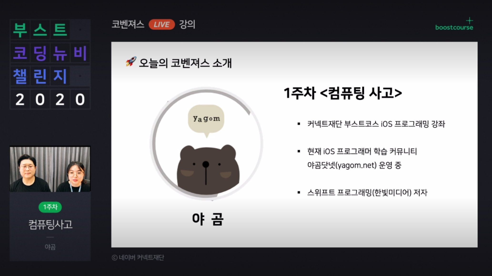
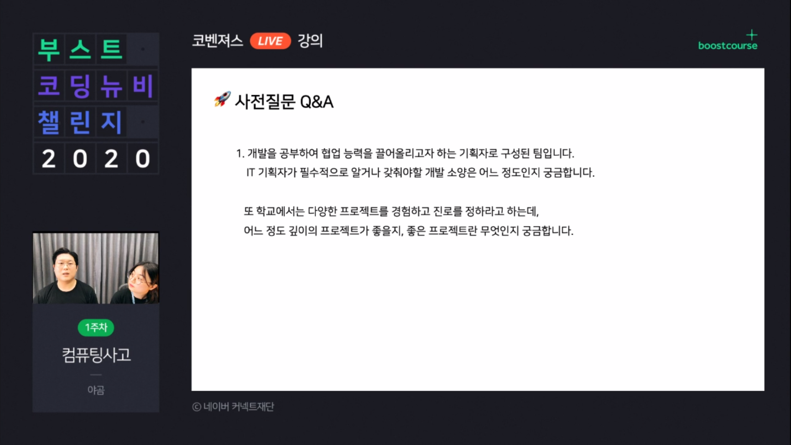
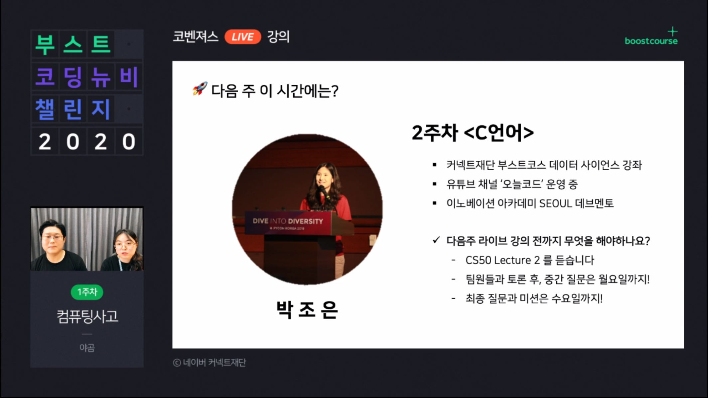

# 부스트코딩뉴비챌린지 LIVE 강의

## 야곰님의 "당신만을위한 컴퓨팅 사고!"

## 2020년 7월 17일 20시

Q. 개발자와 다른 직무와의 관계에 필요한 것은?

> 개발자와 기획자 등 서로 다른 분야의 인원이 서로를 이해하기 위해서는 서로의 직무를 경험하는 것보다도 진심으로 그들의 입장을 듣고 그들의 입장에서 생각해보는게 도움이 된다.

Q. 좋은 프로젝트란?

> 스펙을 쌓기위해서 모여야할 것 같아서 모이는 프로젝트가 아닌 진짜로 해보고 싶은 분야에서 하고 싶어하는 사람들과 모여서 프로젝트를 진행해야 하고, 구성원들과 협업을 할 때 적절한 논쟁과 의견교환이 필요하다.

Q. 스터디 이후의 방향?

> 과정을 수료한 이후 해보고 싶은 분야의 온라인 강의 활용

Q. 알고리즘 공부 및 테스트 준비가 실무에 어느 정도 도움이 되는지?

> 회사에서 인원을 한정된 인원을 선발하기 위한 수단이기 때문에 꼭 도움이 된다고 말하기 힘들고 회사마다 그 정도가 상이하다. 정형화된 문제풀이에 매몰되면 오히려 사고가 좁아진다.(과적합)
